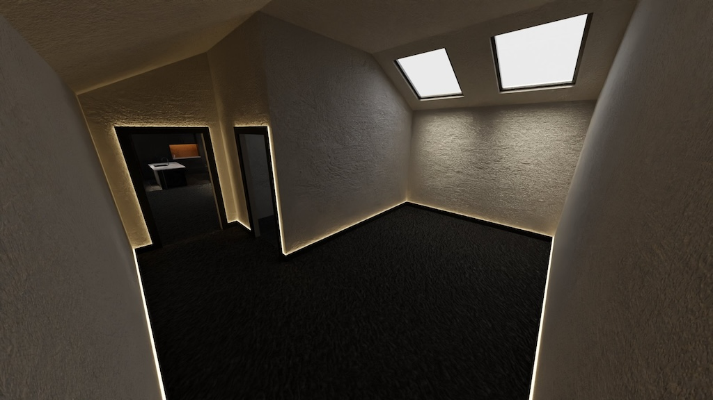
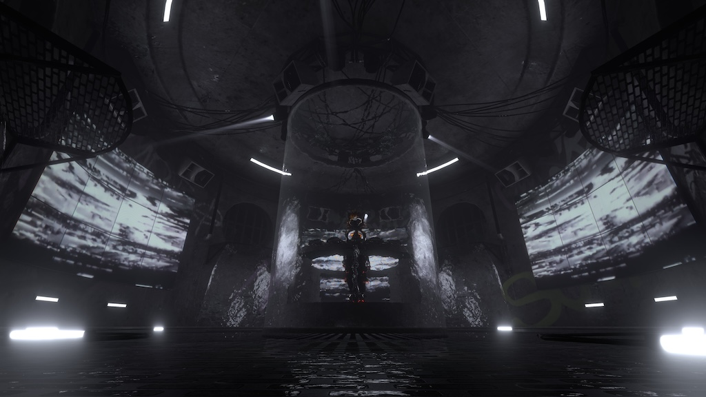

# Chapter 0: Karl Introduction

## Background:
- Undergrad: Music and Sound Recording @ University of York
- Postgrad: Audio and Music Technology @ University of York
- PhD (In Progress): Intelligent Games and Games Intelligence
	- The construction and maintenance of social realities in SocialVR environments.

## How I started using SocialVR:

- Get headset (Quest 2) in COVID Lock-down to play BeatSaber
- Explored VRChat for 1 evening, leave it 3 months because it seemed boring
- Explore Virtual Worlds (Meta Horizon) and was thoroughly disappointed
- Go back to VRChat and actually start talking to people and making a small group of friends
- Get curious about building worlds 
- Learn Blender, learn Unity, learn C# because Udon Graph is terrible
- Build Community of creators and musicians
- Start selling custom boutique worlds and tools to other communities or individuals

## My Modelling Journey

I started my journey making simple layouts of rooms as it was simple to make.

I moved onto making more interesting concept worlds with dynamic audio reactive lighting systems.

I am currently at a full stage production section with DMX real-time control of lighting and screens using industry standard lighting & visuals control systems to enhance the performance.

## Inspiration for this Workshop/Demonstration

This workshop was developed for IGGICon2024 as lots have asked me how to get started making interactive worlds that you can share with friends.

## Goals for the Workshop/Seminar

- Familiarize yourself with Social VR as a concept
- Become familiar with the tools used to create content for SocialVR
- Understand how to create a world for SocialVR

### Hardware

- Laptop (PCVR Minimum Spec)
- PCVR Capable Headset

### Software

- Blender 4.0+ (Recommend 4.2 LTS)
- Unity 2022.3.22f1
- VRChat Creator Companion
