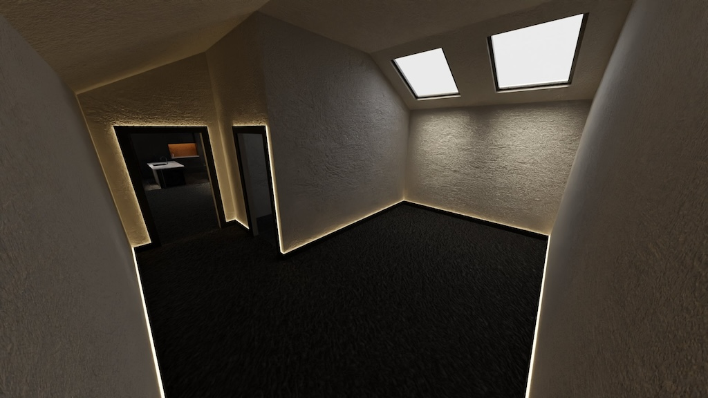
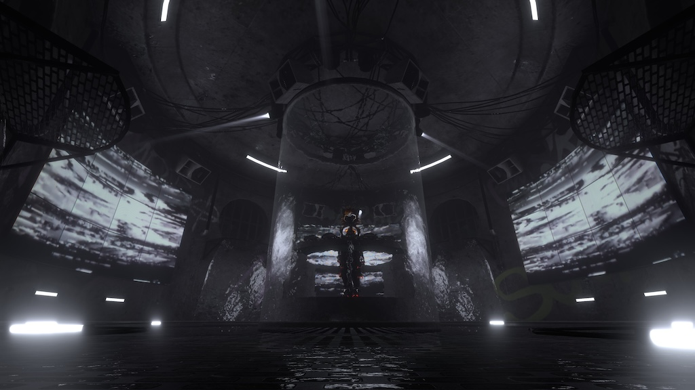
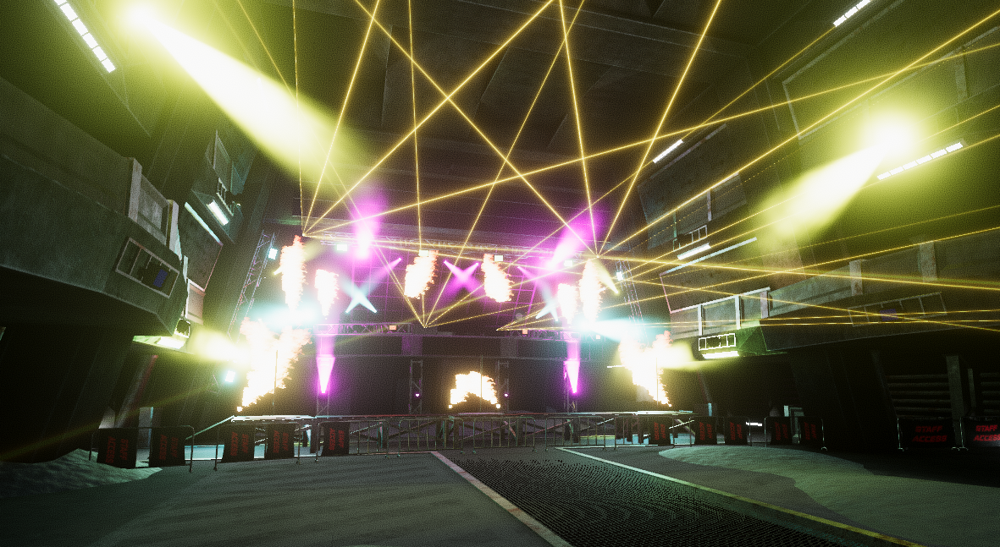

# Chapter 0: Karl Introduction

## Background:
- Undergrad: Music and Sound Recording @ University of York
- Postgrad: Audio and Music Technology @ University of York
- PhD (In Progress): Intelligent Games and Games Intelligence
	- The construction and maintainance of social realities in SocialVR environments.

## SocialVR:
- Be me
- Get headset (Quest 2) in COVID Lockdown to play beatsaber
- Explore VRChat for 1 night
- Leave it 3 months
- Explore Virtual Worlds (Meta Horizon)
- Get curious about building them
- Learn Blender
- Learn Unity
- Learn C# because Udon Graph is terrible
- Build Community of creators and musicians
- Become part of the creator economy
- Start selling custom botique worlds to other communities
- Profit!

## My Modelling Journey

I started my journey making simple layouts of rooms as it was simple to make.

I moved onto making more interesting concept worlds with dynamic audio reactive lighting systems.

I am currently at a full stage production section with DMX realtime control of lighting and screens using industry standard lighting & visuals control systems to enhance the performance.

## Inspiration for this Workshop/Demonstration

This workshop was developed for IGGICon2024, however, lots have been confused as to what I actually do as a part time job. This workshop aims to address how someone is able to make money as a freelancer working by creating bespoke virtual environments. It also aims to identify ways that researchers can use the platform VRChat as a research tool. Further, looking at VRChat not as a game but as a platform to create social experiences.

## Goals for the Workshop/Seminar
- Familiarise yourself with Social VR as a concept
- Become familiar with the tools used to create content for SocialVR
- Understand how to create a world for SocialVR
- Gain an appriciation for design descisions made during the creation process

## Requirements for the Workshop

### Hardware
- Laptop (PCVR Minimum Spec)
- PCVR Capable Headset

### Software
- Blender 4.2+
- Unity 2022.3.22f1
- VRChat Creator Companion
